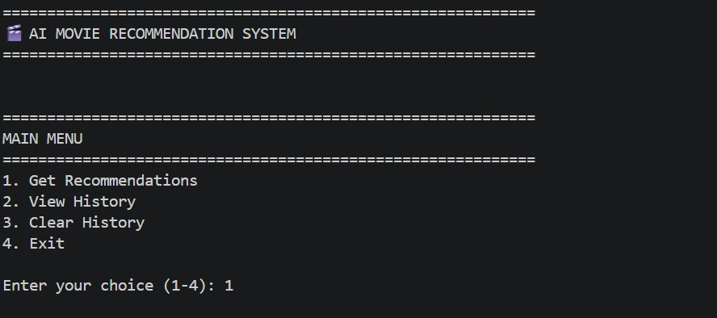
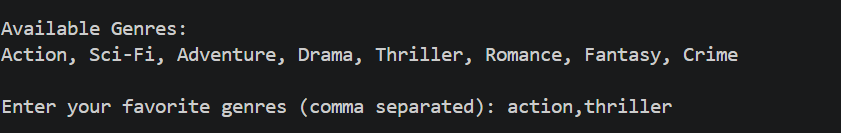
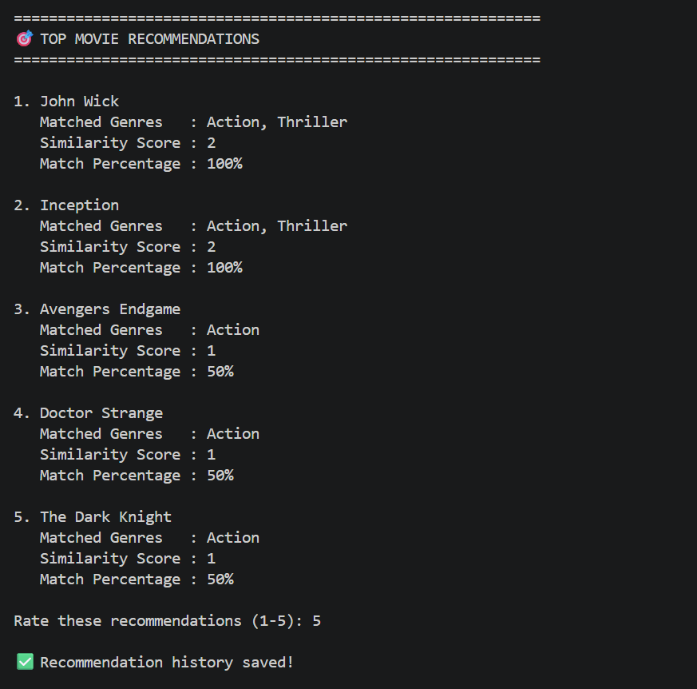
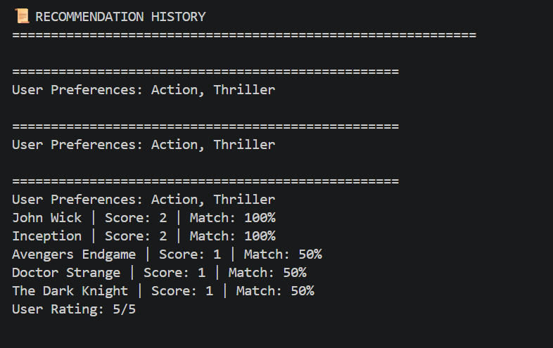

# 🎬 AI Movie Recommendation System

## 📌 Project Overview

The AI Movie Recommendation System is a Python-based application that recommends movies to users based on their preferred genres. The system uses similarity matching logic to compare user interests with movie genres and suggests the most relevant movies.

This project demonstrates the fundamental concepts of recommendation systems, including user preference analysis, pattern matching, similarity scoring, and personalized recommendations.

---

## 🎯 Objectives

- Collect user preferences through genre selection.
- Match user interests with movie genres.
- Calculate similarity scores and match percentages.
- Display personalized movie recommendations.
- Store recommendation history for future reference.
- Provide options to view and clear recommendation history.

---

## 🛠️ Technologies Used

- Python
- File Handling
- Lists
- Dictionaries
- Functions
- Loops
- Conditional Statements

---

## ✨ Features

- Genre-based movie recommendations
- Similarity score calculation
- Match percentage display
- Matched genre explanation
- Recommendation history storage
- View recommendation history
- Clear recommendation history
- Menu-driven interface

---

## 📸 Screenshots

### Main Menu


### User Input


### Recommendations


### Recommendation History


---

## ⚙️ How It Works

1. The user selects favorite movie genres.
2. The system compares the selected genres with the movie database.
3. A similarity score is calculated based on matching genres.
4. Movies are ranked according to their similarity scores.
5. The top recommendations are displayed.
6. Recommendation history is saved in a text file.

---

## 📊 Sample Output

```text
============================================================
🎯 TOP MOVIE RECOMMENDATIONS
============================================================

1. Inception
   Matched Genres   : Action, Sci-Fi
   Similarity Score : 2
   Match Percentage : 100%

2. Avengers Endgame
   Matched Genres   : Action, Sci-Fi
   Similarity Score : 2
   Match Percentage : 100%
```

---

## 📁 Project Structure

```text
AI-Movie-Recommendation-System/
│
├── recommendation.py
├── history.txt
├── README.md
└── screenshots/
```

---

## 🚀 Future Enhancements

- Larger movie database
- CSV-based dataset management
- Graphical User Interface (GUI)
- Machine Learning-based recommendations
- User profiles and personalized suggestions

---

## 🎓 Learning Outcomes

Through this project, I learned:

- Recommendation system fundamentals
- Similarity-based matching
- Python file handling
- Data structures in Python
- Menu-driven application development
- User interaction and input processing

---

## 👨‍💻 Author

Priya Das

Computer Science Engineering Student

Internship Project – AI Recommendation Logic

---

⭐ If you found this project interesting, feel free to explore it!
